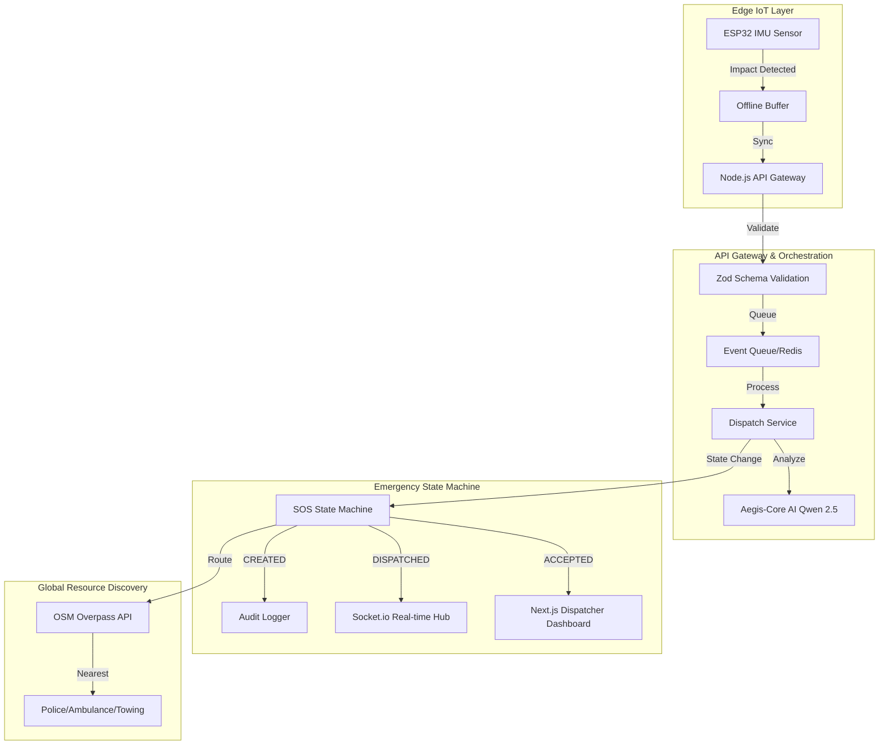

# ADR 01: System Blueprint & Event Flow

## Status: Accepted (Upgraded to Production-Grade)

## Context
Initial review identified a lack of clear event flow and resilience. This ADR now defines the robust, event-driven architecture required for a high-stakes emergency response platform.

## Decision: Event-Driven Resilient Architecture

### 1. System Architecture Diagram

### 2. SOS Lifecycle (State Machine)
To ensure fault tolerance and accountability, every alert follows a strict state machine:
`CREATED` → `ANALYZING` → `DISPATCHED` → `ACCEPTED` → `IN_PROGRESS` → `RESOLVED` | `FAILED`

## Consequences
- **Positive:** Full audit trail for every accident. Decoupled AI analysis and resource routing.
- **Negative:** Slightly higher latency due to state persistence (mitigated by optimized Postgres queries).
